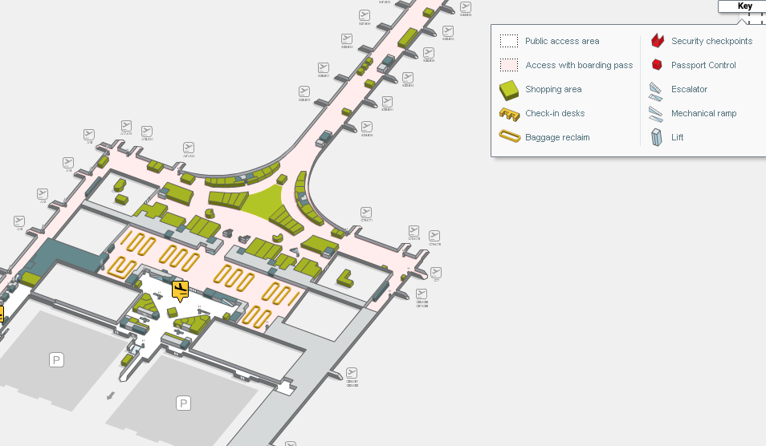

```{r echo=FALSE, message=FALSE,warning=FALSE}
library(readxl)
library(shiny)
library(dplyr)
library(knitr)
```

## **T1**

Airlines: 

* EL AL ISRAEL AIRLINES
* VUELING
* IBERIA
* LUFTHANSA
* SWISS INTL AIRLINES
* AIR FRANCE
* AEROFLOT RUSSIAN AIR
* KLM ROYAL DUTCH AIRLINES
* LOT POLISH AIRLINES
* BRITISH AIRWAYS
* SIBERIA AIRLINES


Please pass the lugagge belt area and go directly to the main arrival hall. Look for **Go Natural** signage (just in front the exit doors). You will find a line of drivers. Look for your driver who will have a sign with **"Investigator Meeting"**.




<style>
p.comment {
background-color: #ffcc99;
padding: 10px;
border: 1px solid black;
border-radius: 5px;
}
</style>

<p class="comment">
If you can't find your driver you can contact Oliver: +34 633 388 839 </p>


## **T2 B**

Airlines: 

* EUROWINGS
* LUXAIR 
* RYANAIR LTD
* TRANSAVIA AIRLINES

Please pass the lugagge belt area and go directly to the main arrival hall. Your driver will be waiting for you just outside the door with a sign of **"Investigator Meeting"**. If you don't see your driver,  find the cafeteria **EAT** and wait there for him/her.


<style>
p.comment {
background-color: #ffcc99;
padding: 10px;
border: 1px solid black;
border-radius: 5px;
}
</style>

<p class="comment">
If you can't find your driver you can contact Oliver: +34 633 388 839  </p>


## **T2 C**

Airlines: 

* EASYJET AIRLINE

Please pass the lugagge belt area and go directly to the main arrival hall. Your driver will be waiting for you just outside the door with a sign of **"Investigator Meeting"**. If you don't see your driver,  find the cafeteria **B by fresh & ready** and wait there for him/her.


<style>
p.comment {
background-color: #ffcc99;
padding: 10px;
border: 1px solid black;
border-radius: 5px;
}
</style>

<p class="comment">
If you can't find your driver you can contact Oliver: +34 633 388 839  </p>


